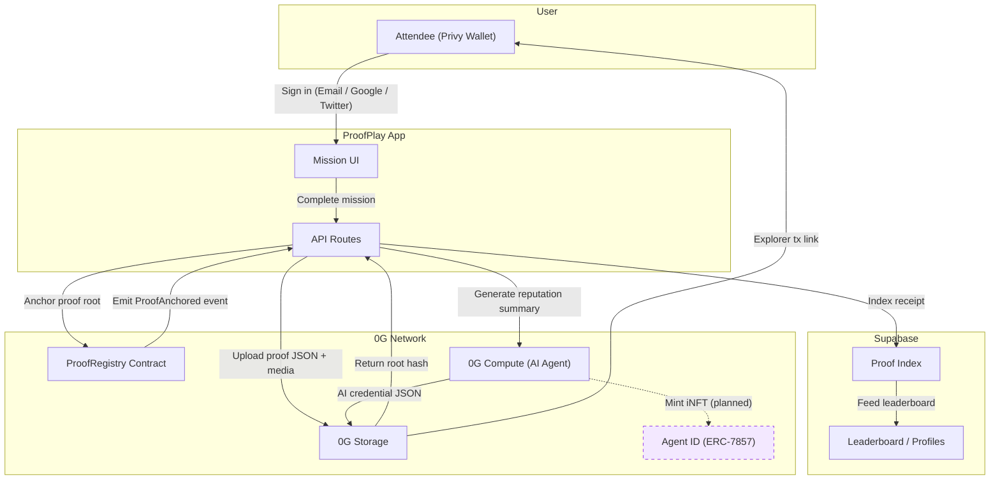

# ProofPlay

**The Reputation Layer for Physical Communities.**

ProofPlay turns real-world event activity — check-ins, booth visits, networking, knowledge quizzes — into tamper-proof, on-chain evidence. Every mission completed by an attendee produces a verifiable proof record stored on **0G Storage**, anchored on-chain via a custom **ProofRegistry** contract, and scored by an AI **Reputation Agent** running on **0G Compute**.

The result: a portable, sybil-resistant reputation layer that event organizers, sponsors, and protocols can trust.

| | Link |
|---|---|
| **Live app** | https://proofplayed.vercel.app |
| **Proof ledger** | https://proofplayed.vercel.app/proofs |
| **About** | https://proofplayed.vercel.app/about |
| **GitHub** | https://github.com/JWattjr/Proofplay |

### 0G Components Used

| Component | Status | How it's used |
|---|---|---|
| **0G Storage** | ✅ Live | Permanent storage for proof JSON, uploaded photos, and AI reputation credentials |
| **0G Compute** | ✅ Live | Reputation Agent runs `zai-org/GLM-5-FP8` to generate AI-assessed reputation summaries from proof history |
| **0G Chain** | ✅ Live | Custom `ProofRegistry.sol` deployed on mainnet — every proof root is anchored with a user-signed tx |
| **Agent ID (ERC-7857)** | 🗺️ Planned | Mint reputation summaries as sovereign iNFTs so users own and port their agent identity (see Roadmap) |

## Architecture




## Evidence Infrastructure

The verification flow integrates 0G Storage, 0G Compute, and a small ProofPlay registry contract:

- SDK: `@0gfoundation/0g-storage-ts-sdk`
- 0G Compute endpoint: `https://router-api.0g.ai/v1/chat/completions`
- 0G Compute model: `zai-org/GLM-5-FP8`
- Mainnet chain ID: `16661`
- Mainnet RPC: `https://evmrpc.0g.ai`
- Storage indexer: `https://indexer-storage-turbo.0g.ai`
- Mainnet Flow contract: `0x62D4144dB0F0a6fBBaeb6296c785C71B3D57C526`
- ProofPlay registry contract: `0xbEE85061D8CAd149006977d7943cBf6063A57cb0`
- Explorer links returned as `https://chainscan.0g.ai/tx/{txHash}`

When a signed-in user completes a mission, ProofPlay:

1. Validates the proof method for that mission.
2. Prepares a canonical proof payload through `/api/verification/prepare`.
3. Uploads the proof JSON to 0G Storage from the user's Privy wallet.
4. Uploads photo bytes to 0G Storage from the user's Privy wallet when the mission uses photo proof.
5. Anchors the 0G proof root on the ProofPlay `ProofRegistry` contract from the user's Privy wallet.
6. Stores the returned 0G root hash, 0G transaction, registry transaction, contract addresses, and explorer URLs in Supabase.
7. Exposes those receipts through `/api/proofs` and the organizer proof panel.
8. Streams uploaded media back from 0G through `/api/proofs/{proofId}/media`.
9. Calls 0G Compute to generate a Proof Agent reputation assessment from verified proof records.
10. Uploads the AI-generated reputation summary JSON back to 0G Storage through `/api/reputation/summary`.

## Roadmap: Agent ID Integration

ProofPlay's Reputation Agent currently generates a JSON credential stored on 0G Storage. The planned next phase tokenizes this credential as a sovereign **ERC-7857 Agent ID (iNFT)** on 0G Chain.

### Why Agent ID?

Today, a user's reputation lives as a JSON blob on 0G Storage — readable and verifiable, but not ownable. With Agent ID:

- **Ownership** — The reputation becomes an NFT the user holds in their wallet. They control who can read it.
- **Portability** — Users carry their ProofPlay reputation agent to other events, protocols, or DAOs without re-proving anything.
- **Delegated access** — Sponsors can pay to query a user's agent without the user transferring ownership. This enables "Reputation-as-a-Service."
- **Evolution** — As the user attends more events, the agent's encrypted metadata updates on-chain, reflecting their latest reputation state.
- **Secure transfer** — If a user sells their agent (e.g., a high-reputation account), TEE-based re-encryption ensures the seller loses access and the buyer gains it atomically.

### Planned flow

```
User completes missions
  → 0G Storage stores proof JSON + media
    → 0G Compute generates AI reputation summary
      → Mint ERC-7857 iNFT containing:
          • encrypted proof history
          • XP / level / badges
          • AI-generated reputation label & narrative
          • behavioral signals for sybil detection
        → User owns a sovereign, portable reputation agent
```

### Agent use cases enabled

| Agent | Description |
|---|---|
| **Sponsor Matchmaking Agent** | Sponsors query Agent IDs to find attendees who completed specific missions (e.g., "visited our booth + attended ZK workshop") |
| **Sybil Detection Agent** | An autonomous fraud agent analyzes Agent ID metadata across events to detect impossible-travel, photo forgery, and bot-farm clustering |
| **Automated Airdrop Agent** | Protocols deploy treasury agents that airdrop tokens to wallets holding Agent IDs above a reputation threshold |
| **Dynamic Ticketing Agent** | Future events query Agent IDs to offer discounted tickets to high-engagement users |

This positions ProofPlay not just as an event app, but as the **data infrastructure layer** for an agentic economy built on 0G.

### Live proof receipt

This repo has produced real 0G Storage receipts for BlockNova mission proofs:

- 0G mainnet contract: `0x62D4144dB0F0a6fBBaeb6296c785C71B3D57C526`
- ProofPlay registry contract: `0xbEE85061D8CAd149006977d7943cBf6063A57cb0`
- ProofPlay registry explorer: `https://chainscan.0g.ai/address/0xbEE85061D8CAd149006977d7943cBf6063A57cb0`
- Latest photo proof JSON root: `0x476fac3e60519bb80e6bd87b4d7278e11ad7fa3bbd38ddaec7154d7af32ff9dc`
- Latest photo media root: `0xbcd7b8b5e1d7e563e7e4019f4d4c74ef7a70ffffe9173acad444cf9d96134177`
- Proof JSON explorer: `https://chainscan.0g.ai/tx/0x1925f2efa5e384bc227460803f99b16eb405055c6dddbfa3446f67923ee1627f`
- Media explorer: `https://chainscan.0g.ai/tx/0x54f6c37cbd1aa6a62539a8312cc1127003071782fa6fa874dc1ef9ac7aa29454`
- Browser media retrieval: `https://proofplayed.vercel.app/api/proofs/proof_m5_66ad2f6e66ad/media`
- Supabase index: `/api/proofs` returns `database.provider = "supabase"` with the stored proof receipt.

## Product Walkthrough

1. Open `https://proofplayed.vercel.app`.
2. Sign in with Privy.
3. Register for BlockNova Event from `/app`.
4. Complete a QR or photo mission.
5. Open `/proofs` to inspect proof root hashes, transaction links, and uploaded media.
6. Open `/about` for the product vision, trust model, and participation flow.
7. Click `Generate 0G reputation summary` to upload a portable Proof Agent summary JSON to 0G Storage.

## Supabase Proof Index

0G Storage remains the permanent evidence layer. Supabase stores the fast app index used by the UI:

- proof record id
- user id / wallet id
- event id
- mission id
- XP earned
- 0G root hash
- 0G transaction hash
- ProofRegistry transaction hash
- explorer URL

## ProofRegistry Contract

`contracts/ProofRegistry.sol` anchors each mission proof root after the evidence is stored on 0G Storage. The contract emits `ProofAnchored` with:

- ProofPlay proof id
- user wallet
- event id
- mission id
- 0G proof root hash
- optional 0G media root hash
- XP earned

Deployed 0G mainnet address:

```text
0xbEE85061D8CAd149006977d7943cBf6063A57cb0
```

Set this in Vercel and local env as `NEXT_PUBLIC_PROOF_REGISTRY_ADDRESS`.

Create the table by running:

```sql
-- supabase/schema.sql
```

## Environment

Copy `.env.example` to `.env.local` and set:

```bash
ZERO_G_PRIVATE_KEY=0x...
ZERO_G_COMPUTE_API_KEY=...
ZERO_G_COMPUTE_BASE_URL=https://router-api.0g.ai/v1
ZERO_G_COMPUTE_MODEL=zai-org/GLM-5-FP8
SUPABASE_URL=https://your-project.supabase.co
SUPABASE_SERVICE_ROLE_KEY=your-server-only-service-role-key
NEXT_PUBLIC_PRIVY_APP_ID=your-privy-app-id
NEXT_PUBLIC_PRIVY_CLIENT_ID=your-optional-privy-client-id
NEXT_PUBLIC_PROOF_REGISTRY_ADDRESS=0xbEE85061D8CAd149006977d7943cBf6063A57cb0
```

Each user needs 0G in their Privy wallet to pay for mission proof uploads and ProofRegistry anchors. The server private key is still used for server-side 0G writes such as Proof Agent reputation summaries. Without Supabase env vars, local development uses an in-memory proof index; production should use Supabase.

Privy is used for wallet/email/social login. Mission submissions from the app use the authenticated wallet address when available, then fall back to the Privy user id.

## Development

```bash
npm install
npm run dev
```

Useful checks:

```bash
npm run lint
npm run build
```
